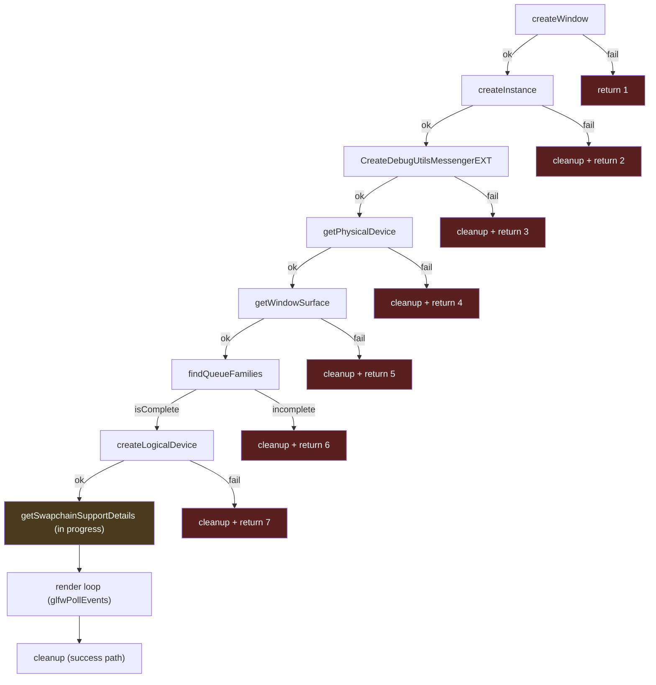

# Tannery — Architecture Brain Map

A visual snapshot of everything built so far, current as of Milestone 1 / Step 7
(swapchain, in progress). Two views: a **structural diagram** (module
relationships, in the spirit of a classic GoF UML class diagram) and a
**build-order flow diagram** (the actual sequence `main.cpp` runs through).

This file is a living snapshot, not auto-generated — re-sync it by hand whenever
a new module/file pair is added.

---

## 1. Structural diagram (module relationships)

Each Vulkan "concern" is modeled as a class: its exposed free function(s) as
methods, and any struct it owns as attributes. `..>` is a dependency ("uses to
produce"), `-->` is an association ("needs a handle from"). This project is raw
procedural C-API code, not real OOP — treat the boxes as **file-pair modules**,
not literal C++ classes.

```mermaid
classDiagram
    class main_cpp {
        <<orchestrator>>
        +main() int
    }

    class WindowHandling {
        <<module>>
        +createWindow(w, h, title) GLFWwindow*
    }

    class VulkanInstance {
        <<module>>
        +createInstance(appName) VkInstance
    }

    class DebugCallbackVulkan {
        <<module, header-only>>
        +populateDebugMessengerCreateInfo(info)
        +CreateDebugUtilsMessengerEXT(...) VkResult
        +DestroyDebugUtilsMessengerEXT(...)
        -debugCallback(...) VkBool32
    }

    class PhysicalDevice {
        <<module>>
        +getPhysicalDevice(instance) VkPhysicalDevice
        +printPhysicalDevices(instance)
    }

    class Surface {
        <<module>>
        +getWindowSurface(instance, window) VkSurfaceKHR
    }

    class QueueFamilyIndices {
        <<struct>>
        +optional~uint32_t~ graphicsFamilyIndex
        +optional~uint32_t~ presentFamilyIndex
        +isComplete() bool
    }

    class QueueFamilies {
        <<module>>
        +findQueueFamilies(physicalDevice, surface) QueueFamilyIndices
    }

    class LogicalDeviceInfo {
        <<struct>>
        +VkDevice logicalDevice
        +VkQueue graphicsQueue
        +VkQueue presentQueue
    }

    class LogicalDevice {
        <<module>>
        +createLogicalDevice(physicalDevice, familyIndices) LogicalDeviceInfo
    }

    class SwapchainSupportDetails {
        <<struct, in progress>>
        +VkSurfaceCapabilitiesKHR capabilities
        +vector~VkSurfaceFormatKHR~ formats
        +vector~VkPresentModeKHR~ presentModes
        +isComplete() bool
    }

    class SwapchainSupport {
        <<module, in progress>>
        +getSwapchainSupportDetails(physicalDevice, surface) SwapchainSupportDetails
    }

    class Cleanup {
        <<module>>
        +cleanup(window, instance, messenger, device, surface)
    }

    main_cpp ..> WindowHandling : creates window
    main_cpp ..> VulkanInstance : creates instance
    main_cpp ..> DebugCallbackVulkan : creates messenger
    main_cpp ..> PhysicalDevice : selects GPU
    main_cpp ..> Surface : creates surface
    main_cpp ..> QueueFamilies : queries indices
    main_cpp ..> LogicalDevice : creates device
    main_cpp ..> SwapchainSupport : queries support
    main_cpp ..> Cleanup : tears down

    VulkanInstance ..> DebugCallbackVulkan : chains messenger info via pNext
    PhysicalDevice --> VulkanInstance : requires VkInstance
    Surface --> VulkanInstance : requires VkInstance
    Surface --> WindowHandling : requires GLFWwindow*
    QueueFamilies --> PhysicalDevice : requires VkPhysicalDevice
    QueueFamilies --> Surface : requires VkSurfaceKHR
    QueueFamilies ..> QueueFamilyIndices : produces
    LogicalDevice --> PhysicalDevice : requires VkPhysicalDevice
    LogicalDevice --> QueueFamilyIndices : requires
    LogicalDevice ..> LogicalDeviceInfo : produces
    SwapchainSupport --> PhysicalDevice : requires VkPhysicalDevice
    SwapchainSupport --> Surface : requires VkSurfaceKHR
    SwapchainSupport ..> SwapchainSupportDetails : produces
```

**Reading it:** everything ultimately traces back to `VulkanInstance` — no other
module can exist without a `VkInstance` first. `PhysicalDevice` and `Surface`
are the two "hubs" everything else after them depends on: both `QueueFamilies`
and `SwapchainSupport` need *both* a `VkPhysicalDevice` and a `VkSurfaceKHR`
together, since queue/swapchain support is a property of that specific
GPU-plus-window-system pairing, not either one alone.

---

## 2. Build-order flow (what `main.cpp` actually runs)

The structural diagram shows *relationships*; this shows *execution order* —
the literal top-to-bottom sequence in `main.cpp`, including where each early-out
failure branch goes.

**Reading it:** every step is a strict prerequisite for the next — this is a
linear pipeline, not a tree, which is why `cleanup()` always needs to know
exactly how far the pipeline got (hence every early-return branch calling it
with `VK_NULL_HANDLE` placeholders for anything not yet created). The
teardown order in `cleanup.hpp` runs this exact chain in reverse.

---

## Legend

| Symbol | Meaning |
|---|---|
| `..>` | dependency — "uses this to produce something" |
| `-->` | association — "needs a handle owned by this" |
| `<<module>>` | a `.hpp`/`.cpp` file pair, one Vulkan concern each |
| `<<struct>>` | a plain data-holding type, no owned Vulkan lifetime logic |
| red flowchart node | an early-return failure path (always calls `cleanup()` first) |
| amber flowchart node | current in-progress step (Step 7: swapchain) |
